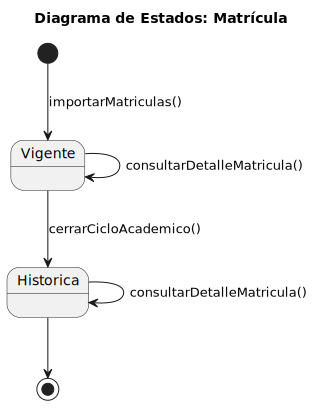

# 🕐 Diagrama de Estado — Matricula

|          |
| ------------------------------------------------------------------------------------------------------------------------------------------------------------------------------------------------------------------------------------------------------------------------------------------------------------------------------------------------------------------------------------------------------------------------------------------------------------------------------------------------------------------------------------------------------------------------------------------------------------------------------------------------------------------------------------------------------------------------------------------------------------------------------------------------------------------------------------------------------------------------------------------------------------------------------------------------------------------------------------------------------------------------------------------------------------------------------------------------------------------------------: |

---

## 🕐 Diagrama de Estado - Matricula

Este diagrama define los posibles estados por los que puede transitar una Matricula en el sistema, así como las transiciones permitidas entre ellos.

📁 [Carpeta](.) | 📄 [SVG](./Matricula.svg) | 📋 [PUML](./Matricula.puml)

---

> ✨ *Los diagramas de estado modelan el ciclo de vida de las entidades principales, permitiendo comprender y validar los comportamientos dinámicos del sistema.*

