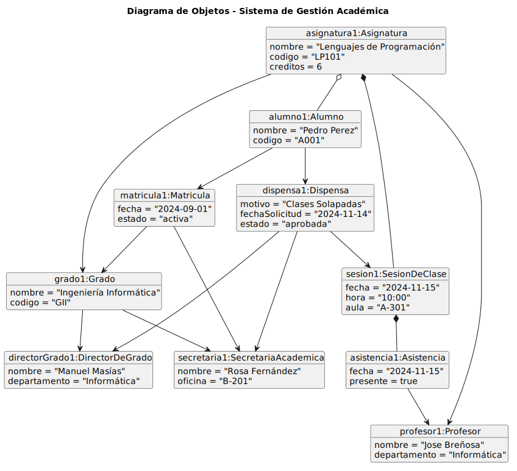
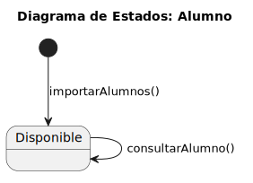
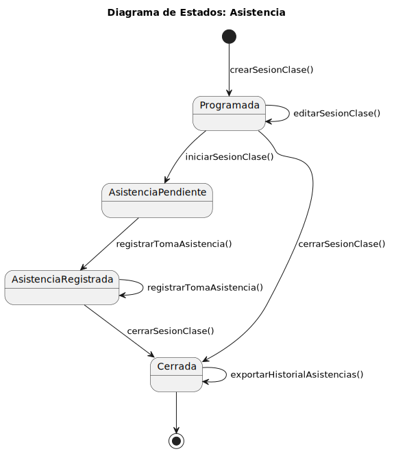
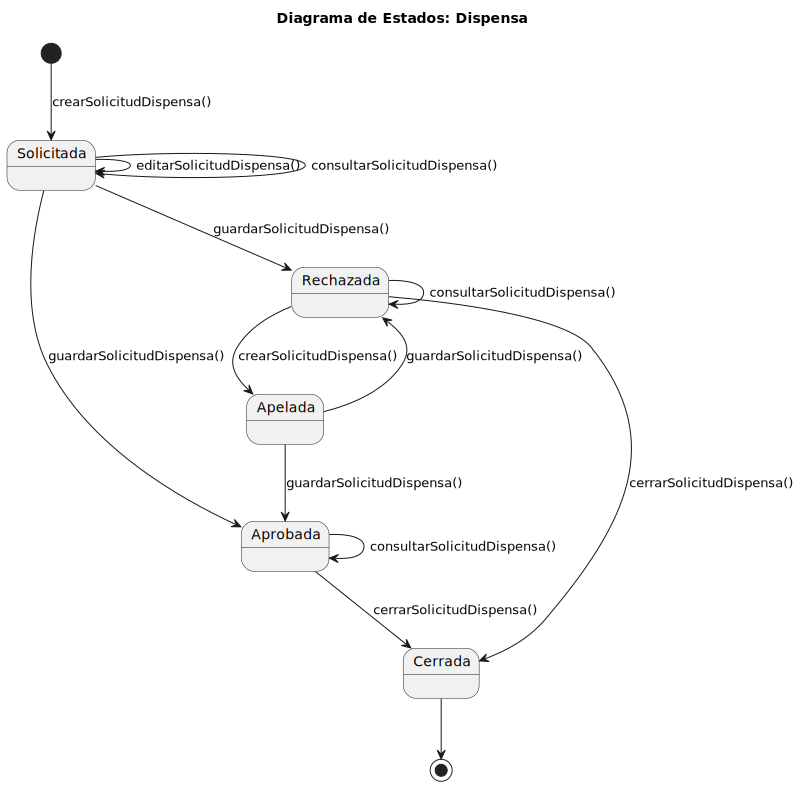

# Modelo del Dominio

|           |
| ---- |

Representación de las entidades principales del sistema, sus atributos, relaciones y comportamientos.

---

## Diagrama de Clases

  

---

## Diagrama de Objetos

  

---

## Diagramas de Estados

### Alumno

  

---

### Asistencia

  

---

### Director de Grado

  

---

### Dispensas

  

---

### Lista de Alumnos

  

---

### Matrícula

  

---

### Sesión de Clase

  

---

