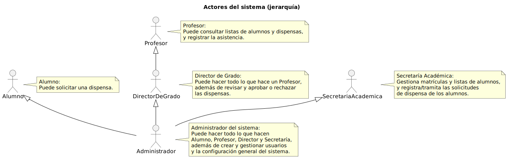

# Actores del Sistema

|           |
| ---- |

Diferentes tipos de usuarios y agentes que interactúan con el sistema.

---

## Actores

- Administrador
- Profesor
- Alumno
- Secretaria
- Director de Grado

---

## Diagrama de Actores

  

\n\n

---

