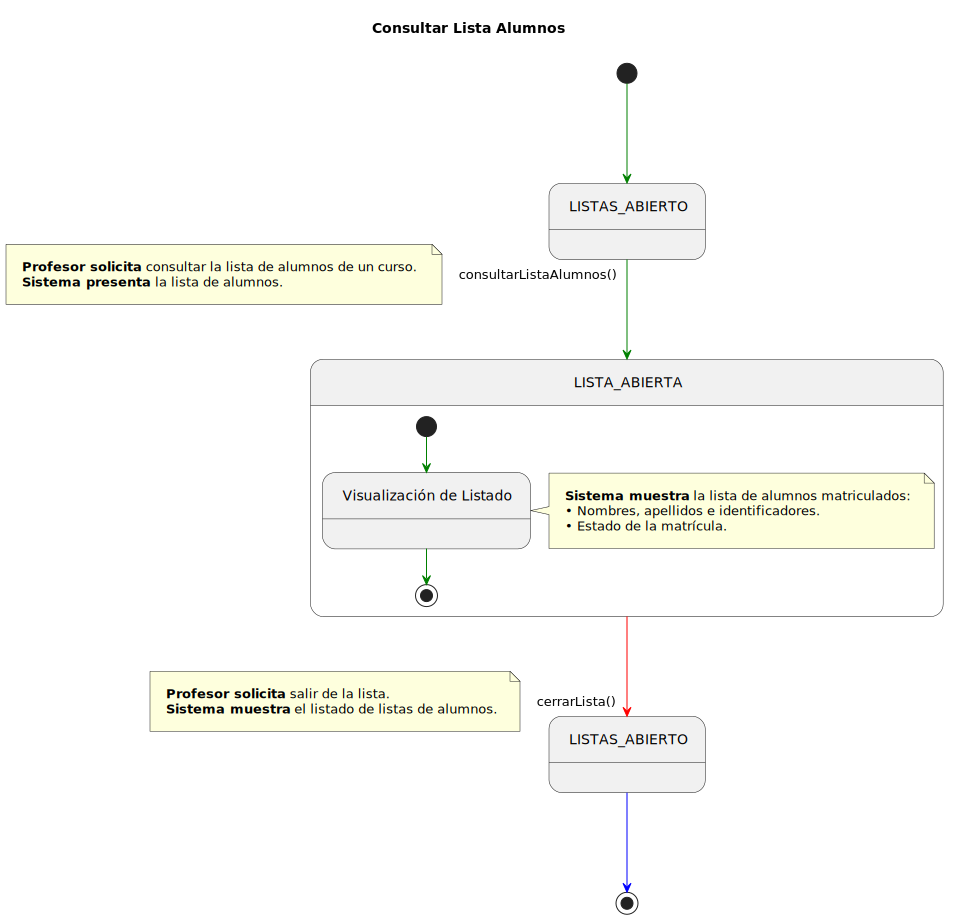
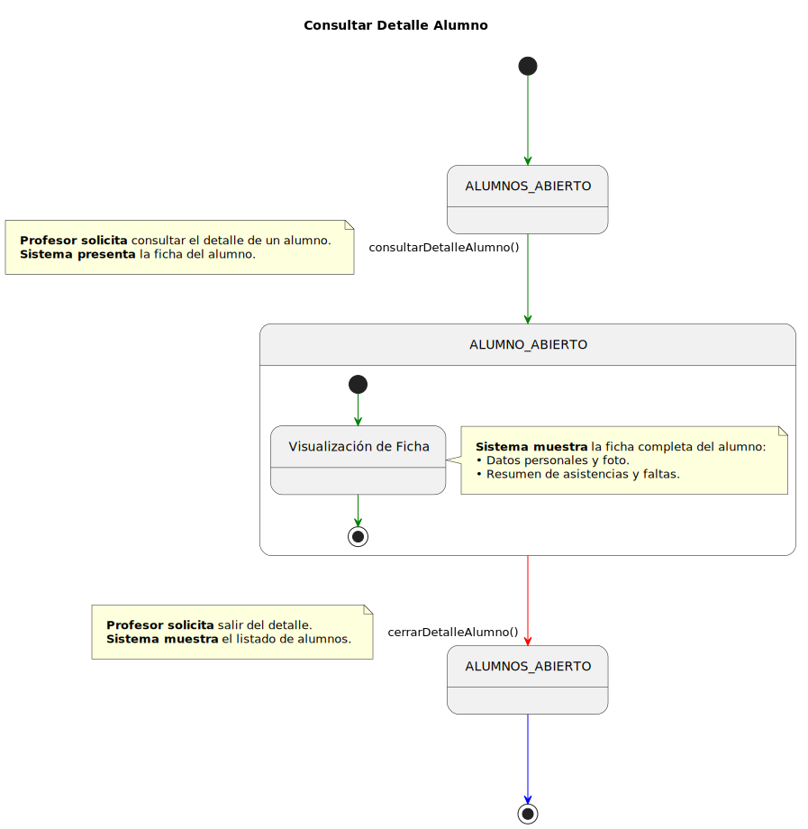
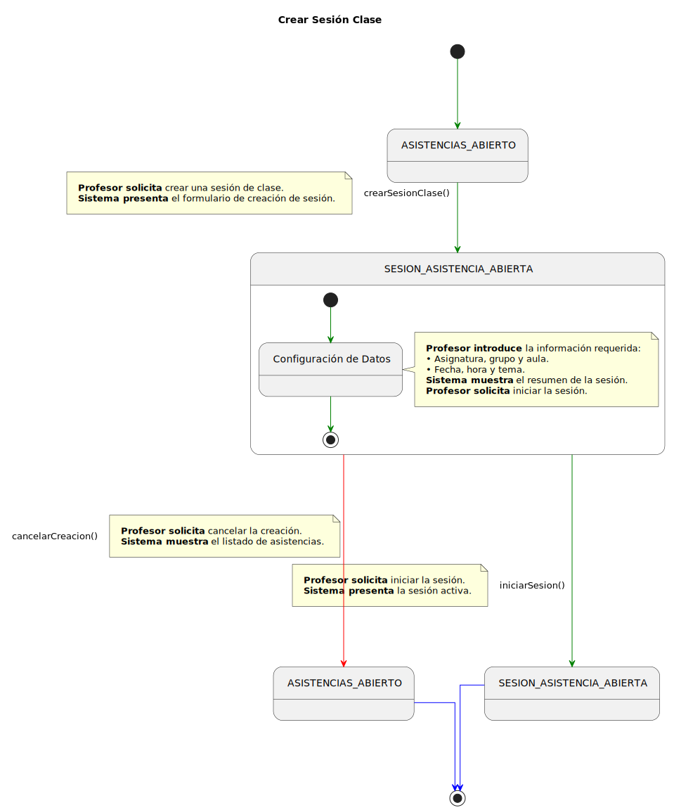
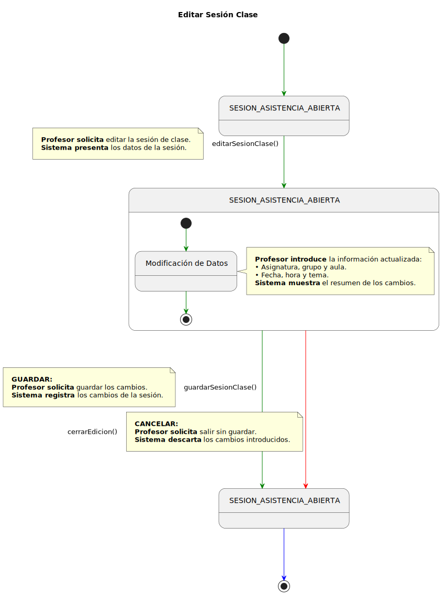
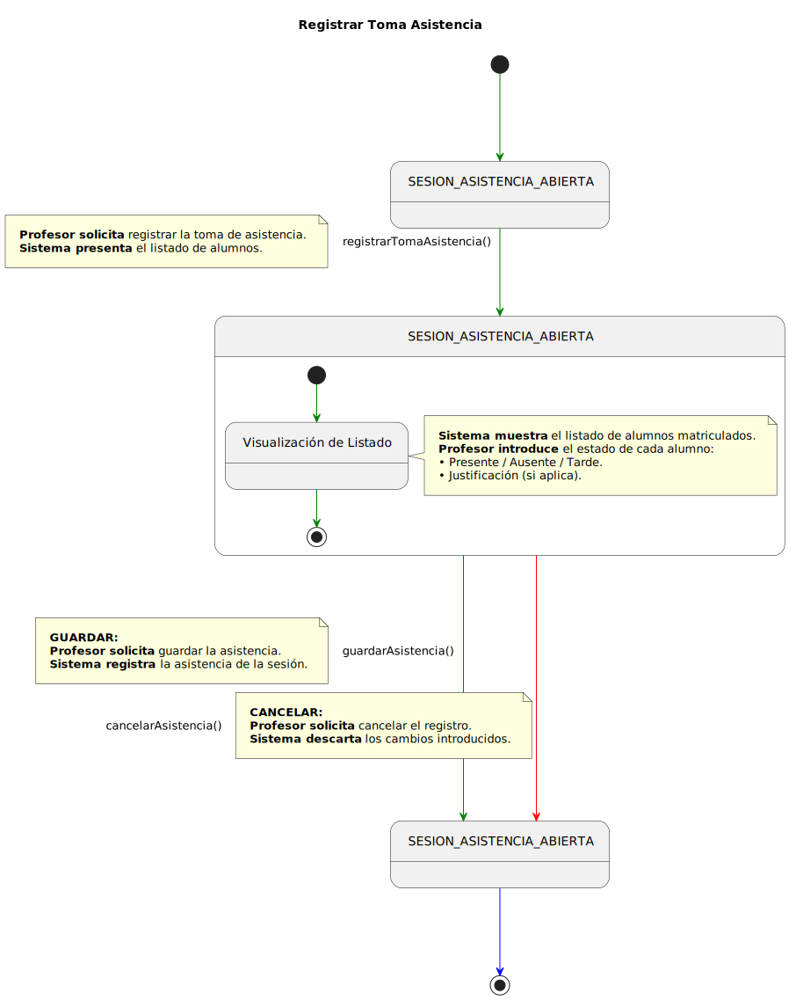
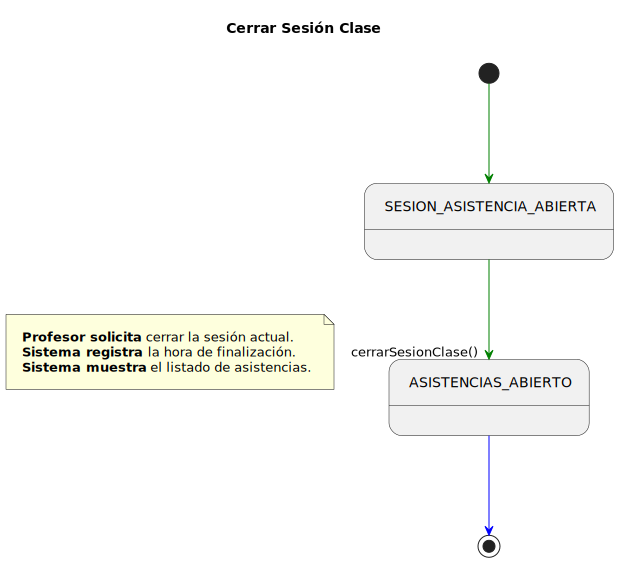
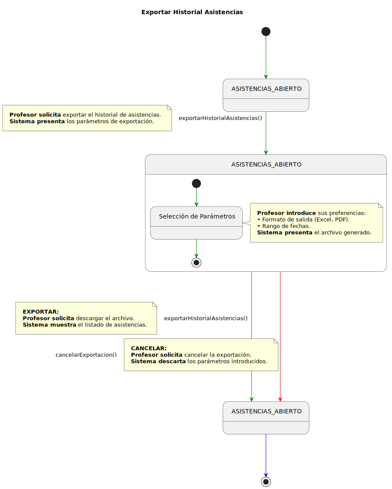
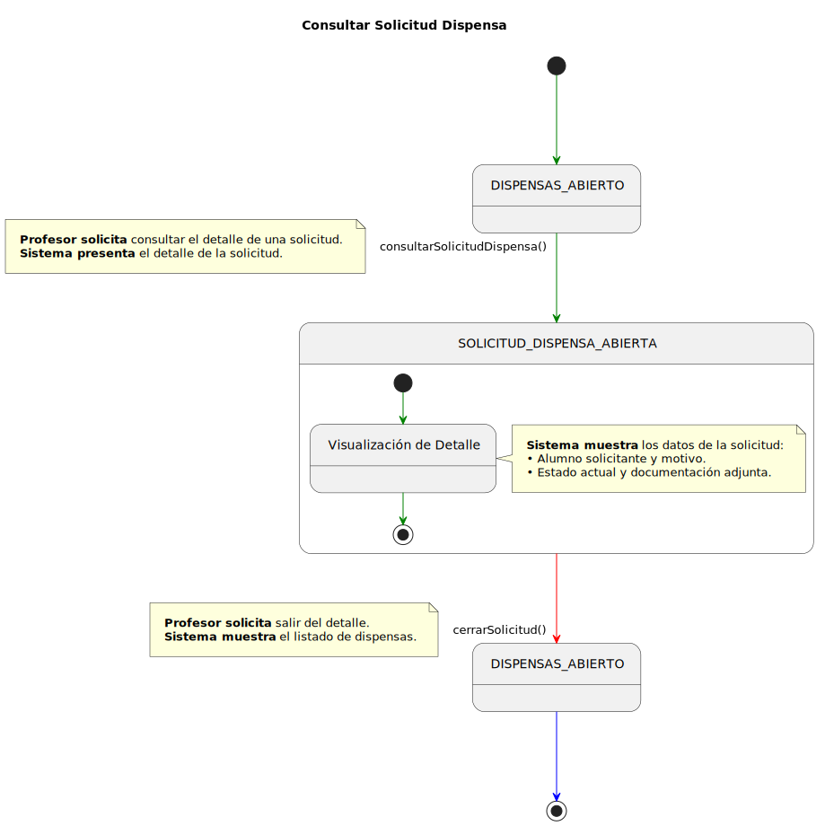

# Detallado Casos de Uso Profesor

## Listas

### Consultar Lista de Alumnos

  

   

---

## Alumnos

### Consultar Detalle Alumno

  

   

---

## Asistencias

### Crear Sesión de Clase

  

   

### Editar Sesión de Clase

  

   

### Registrar Toma de Asistencia

  

   

### Cerrar Sesión de Clase

  

   

### Exportar Historial de Asistencias

  

   

---

## Dispensas

### Consultar Solicitud de Dispensa

  

   
