

|          |
| ---- |

# Detallado de Casos de Uso

    

---

## Alumno

### Crear Solicitud de Dispensa

  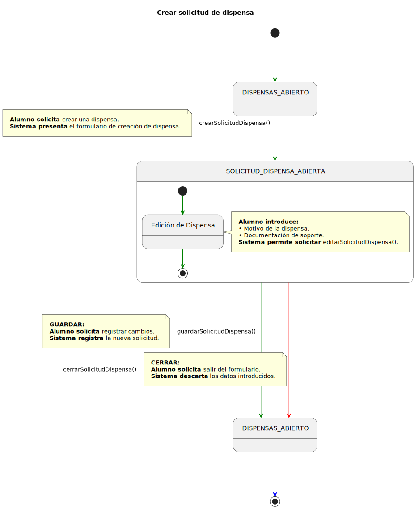

   

### Editar Solicitud de Dispensa

  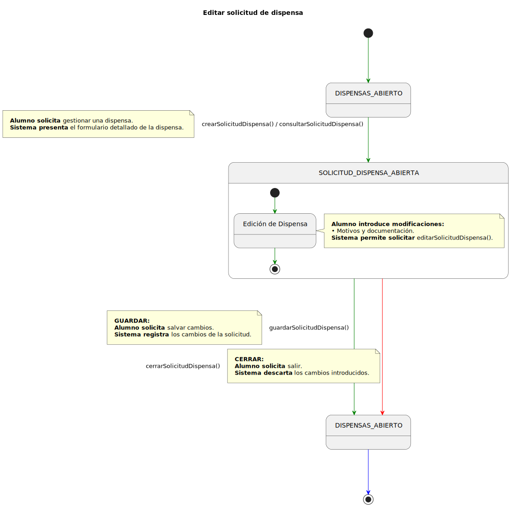

   

### Consultar Estado de Dispensa

  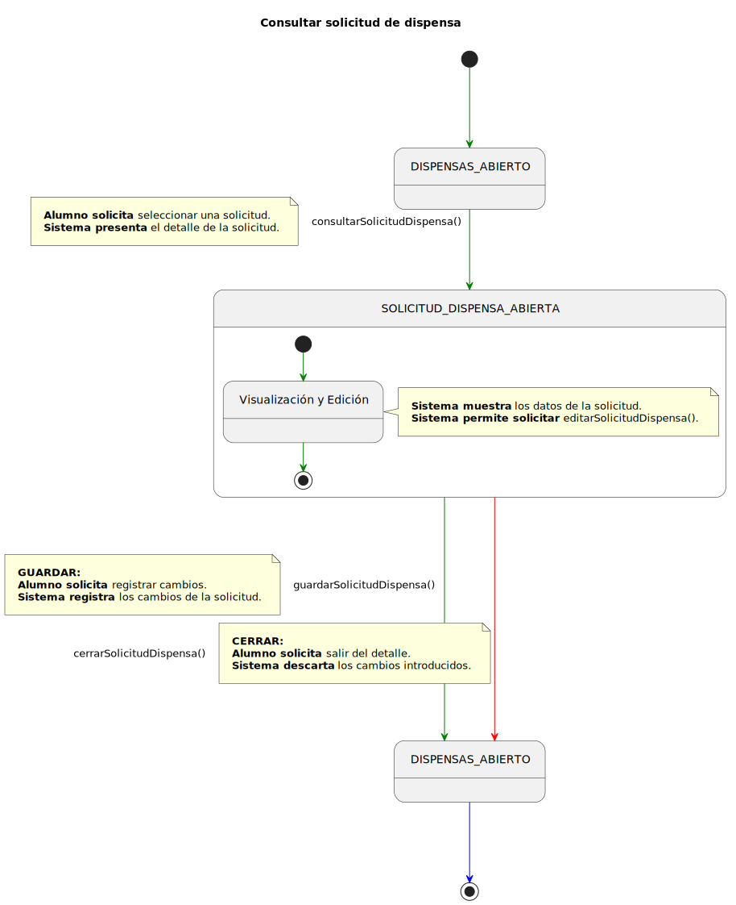

   

---

## Profesor

### Crear Sesión de Clase

  

   

### Cerrar Sesión de Clase

  

   

### Registrar Toma de Asistencia

  

   

### Consultar Lista de Alumnos

  

   

### Editar Sesión de Clase

  

   

### Consultar Solicitud de Dispensa

  

   

### Exportar Historial de Asistencias

  

   

### Consultar Detalle de Alumno

  

   

---

## Administrador

### Crear Usuario

  

   

### Editar Usuario

  

   

### Consultar Usuario

  

   

---

## Secretaria

### Consultar Detalle de Matrícula

  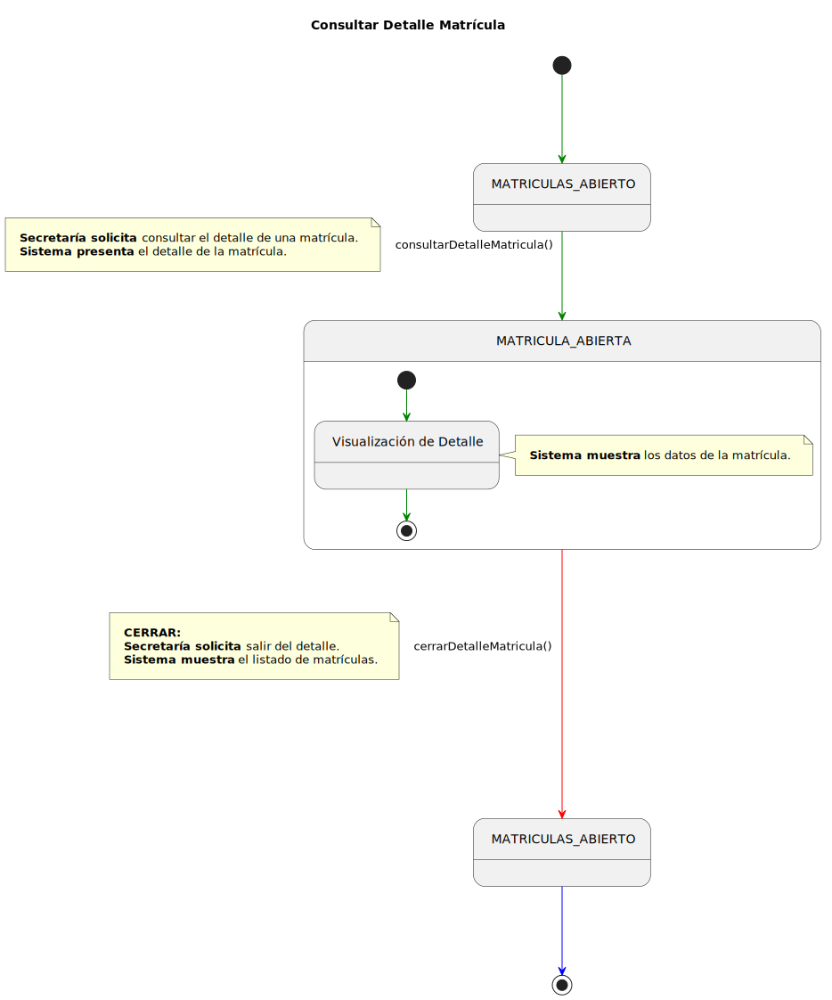

   

### Consultar Lista de Alumnos

  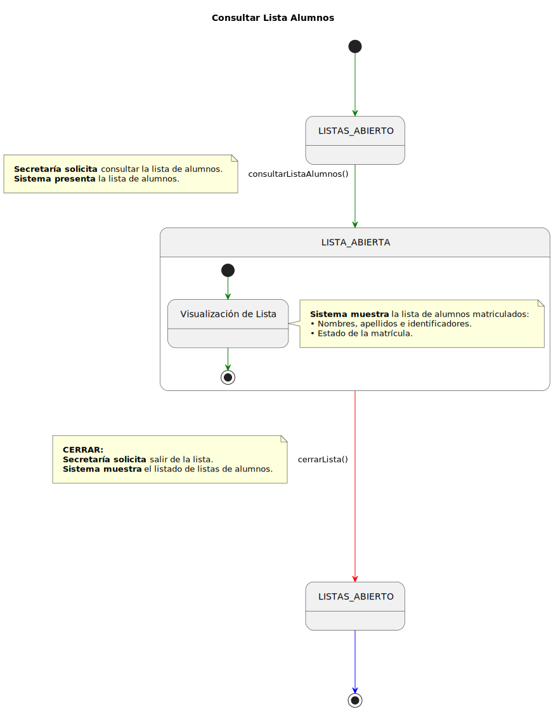

   

### Consultar Solicitud de Dispensa

  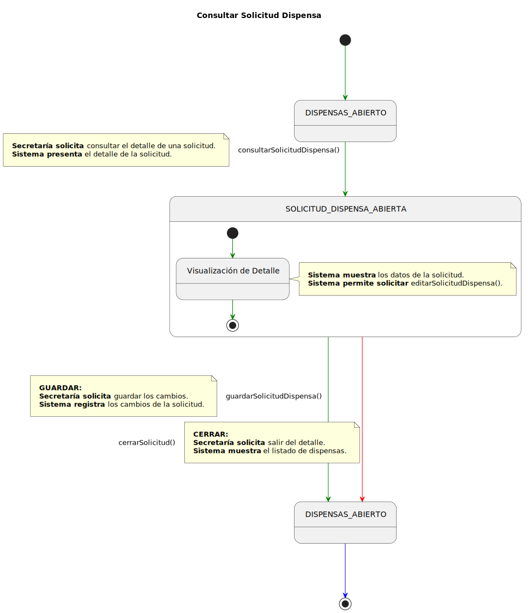

   

### Crear Solicitud de Dispensa

  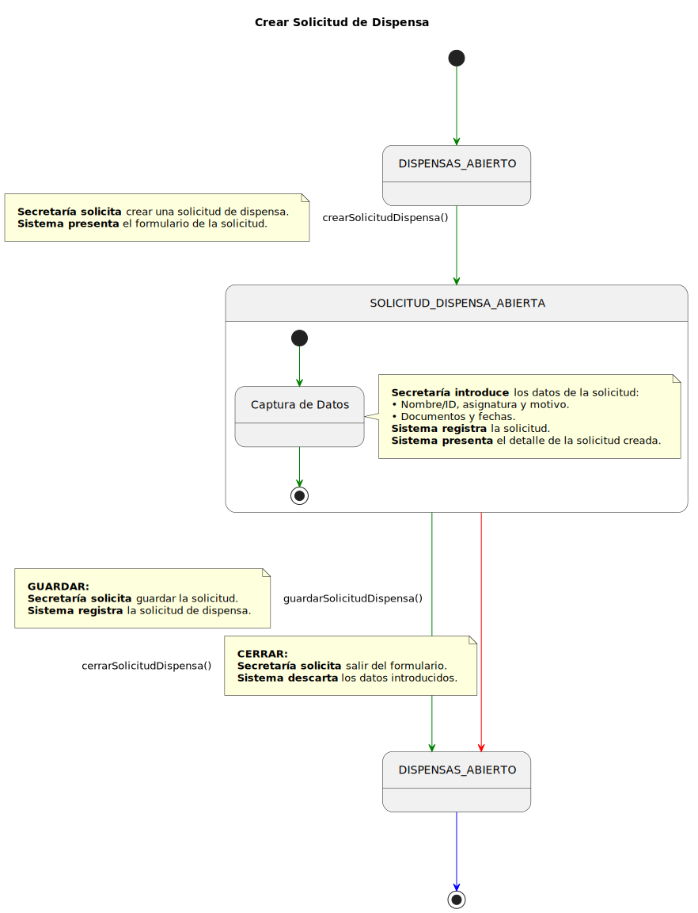

   

### Editar Solicitud de Dispensa

  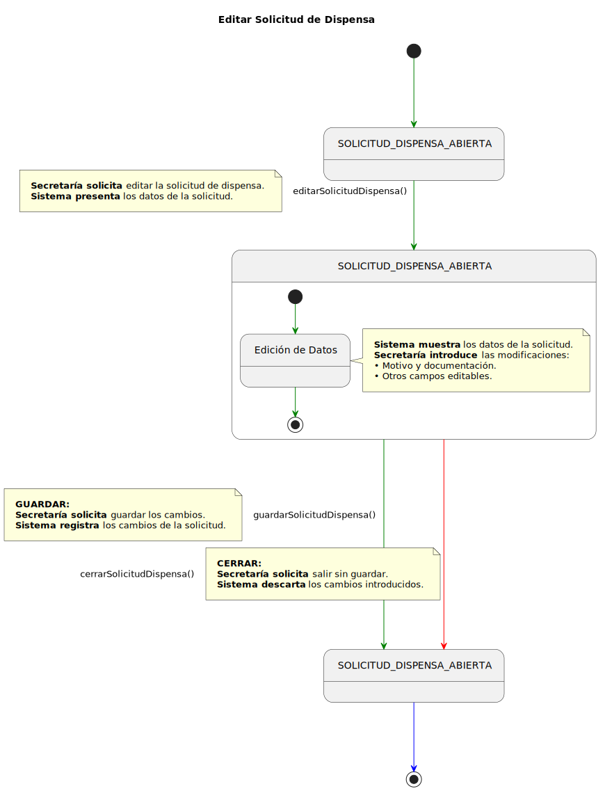

   

### Exportar Dispensas

  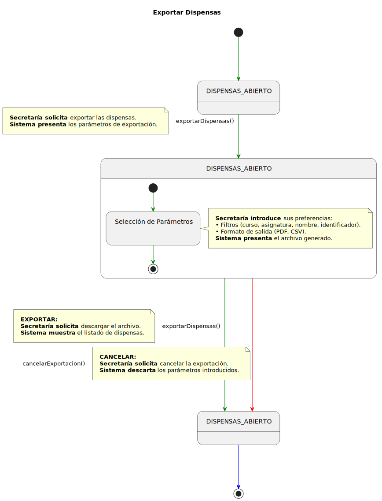

   

### Importar Listas de Alumnos

  

   

### Importar Matrícula

  

   

---

## Director de Grado

### Consultar Solicitudes de Dispensas

  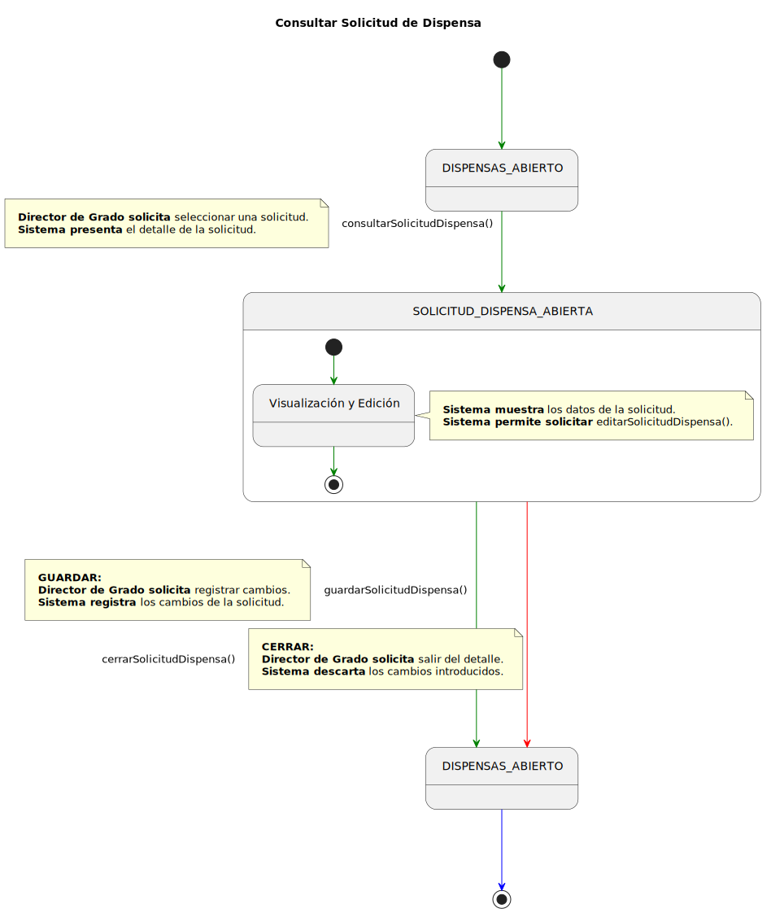

   

### Editar Solicitudes de Dispensas

  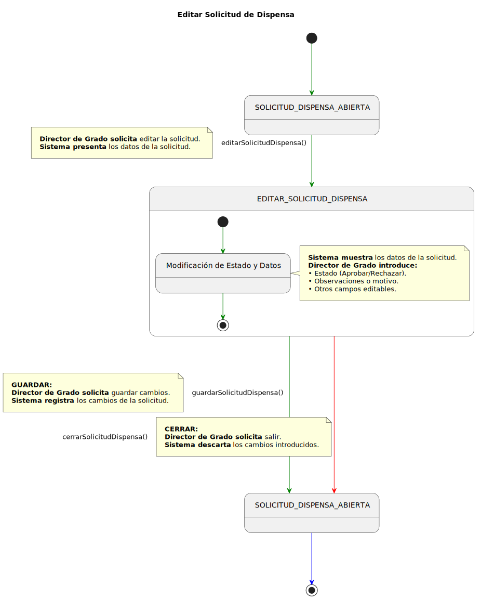

   

---

|          |
| ---- |

